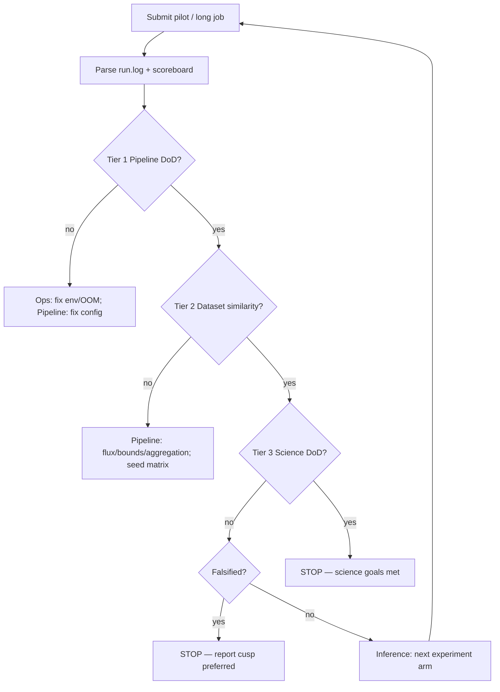

# Definition of Done — CANFAR visibility-fitting agents

Autonomous agents on CANFAR run the production pipeline, inspect outputs, and iterate
(config changes, long chains, seed matrices) until this DoD is met **or** the science
hypothesis is **falsified** with documented evidence.

**Science question:** Does the gNFW inner slope γ prefer a **cored** profile (γ ≈ 0)
because the stellar disk dominates the inner CO rotation curve?

**Primary galaxy (reference implementation):** KGAS066 / KILOGAS066  
**Primary production arm:** `5kms_baseline_obsSb` or scoreboard winner under the gates below.

---

## How agents use this document



Agents **must not** claim science success until **all three tiers** pass on the same
`experiment_id` (long chain, `status=complete`).

Automated check (after each job):

```bash
python3 scripts/aggregate_science_matrix.py \
  --matrix-root science_matrix/KGAS066 \
  --also-scan ${ARC_BASE}/results/KILOGAS066
```

---

## Tier 1 — Pipeline Done (technical validity)

The run is a valid visibility-space fit. Failure here → fix plumbing, not priors.

| # | Criterion | Threshold | Source |
|---|-----------|-----------|--------|
| P1 | Run completed | `result.npz` exists; `run.log` status `complete` | `science_scoreboard.parse_run_log` |
| P2 | Aggregation-aware likelihood | `--aggregation-aware-likelihood` (not legacy control) | manifest / `run.log` CONFIG |
| P3 | Forward path | KinMS gNFW → NUFFT → χ²; no image-domain likelihood | architecture |
| P4 | Git revisions logged | `GIT REVISIONS` block present; uvkin + uvfit SHAs pinned | `run.log` |
| P5 | MCMC convergence | `Converged: True` | `run.log` |
| P6 | Chain length sufficient | `N_steps ≥ tau_factor × τ_max` (default `tau_factor=50`) | `run.log` MCMC block |
| P7 | Acceptance fraction | `0.15 ≤ mean(acceptance_fraction) ≤ 0.55` | `run.log` |
| P8 | No catastrophic walls | `gamma_wall_hi < 0.95` **and** `r_scale_wall_lo < 0.95` | `param_summary.txt` / CHAIN SUMMARY |
| P9 | Legacy control not winner | Winning arm is **not** `legacy_no_agg` on scoreboard | `scoreboard.md` |

**Agent action if Tier 1 fails:**

| Failure | Owner | Action |
|---------|-------|--------|
| OOM / timeout | Ops | Reduce `n_processes`; resubmit |
| `Converged: False` | Ops + Inference | Extend `max-steps`; tune `initial_ball_fraction` |
| P8 walls | Pipeline + Inference | `5kms_baseline_fixrscale`, flux audit, seed matrix |
| P9 legacy wins | Pipeline | Fix aggregation; halt science claims |

---

## Tier 2 — Dataset Similarity Done (model matches data)

The best-fit model is **similar to the dataset** in both visibility space (primary) and
imaging diagnostics (secondary). This tier does **not** use CLEAN cubes in the likelihood;
it checks that the forward model reproduces observed morphology and flux after fit.

### 2A — Visibility-space agreement (primary)

| # | Criterion | Threshold | Source |
|---|-----------|-----------|--------|
| V1 | Reduced χ² at MAP | `rchi2_MAP ≤ 1.2` | `run.log` / `result.npz` |
| V2 | Competitive vs alternatives | `rchi2_MAP` within **10%** of best agg-aware arm in matrix | `scoreboard.csv` |
| V3 | Flux anchor | `--flux-seed-source auto` (visibility audit), unless Science Lead approves `mom0` | CONFIG |
| V4 | MAP flux vs vis audit seed | `0.5 ≤ MAP_flux / flux_audit_seed ≤ 2.0` | `FLUX AUDIT` + CHAIN SUMMARY |
| V5 | Line detection | `line_excess_power ≥ 1.2` (30 km/s) or `≥ 1.5` (5 km/s arms) | `PRE-FIT DIAGNOSTICS` |
| V6 | Degeneracy probes | No single probe (flux×0.1, γ=0/1, etc.) improves rchi2 by **>30%** vs seed | `Degeneracy probes` |

### 2B — Imaging diagnostic similarity (secondary, same geometry)

These use DR1 moment maps and preflight cubes — **QA only**, not the fit objective.

| # | Criterion | Threshold | Source |
|---|-----------|-----------|--------|
| I1 | Preflight inClouds mom0 xcorr | `≥ 0.95` | `PREFLIGHT CUBE` (30 km/s DR1) |
| I2 | Preflight sim/obs flux ratio | `0.85 ≤ ratio ≤ 1.15` | `PREFLIGHT CUBE` |
| I3 | Best-fit imaging-grid mom0 xcorr | `≥ 0.50` | `bestfit_on_imaging_grid/` / `run.log` |
| I4 | Imaging-grid flux ratio | `0.40 ≤ MAP_flux/mom0_integrated ≤ 2.5` **documented** | flux audit + mom0 |
| I5 | PV / moment PNGs | No gross kinematic flip vs mom1 (manual or Science Lead) | `bestfit_comparison/` |

**KGAS066 smoke reference** (local gate before CANFAR): preflight xcorr ≈ **0.98**,
sim/obs flux ratio ≈ **0.97** (`tests/test_kgas066_local_smoke.py`).

**Agent action if Tier 2 fails:**

| Failure | Action |
|---------|--------|
| V1 high rchi2 | Long chain; check aggregation; compare SB arms (`obs_mom0` vs `exp_disk`) |
| V4 flux mismatch | Re-run flux audit; adjust `flux_bounds_jy_kms`; avoid mom0 anchor unless validation arm |
| I3 low mom0 corr with I1 good | Flux–shape degeneracy: `5kms_baseline_fixrscale`, mom0 SB arm, seed matrix |
| V5 weak line at 5 km/s | Prefer `30kms_baseline_obsSb` for production claim |

---

## Tier 3 — Science Done (hypothesis supported)

All Tier 1–2 gates pass **and** the cored-inner-γ hypothesis is supported with
identifiable inference.

| # | Criterion | Threshold | Interpretation |
|---|-----------|-----------|----------------|
| S1 | γ MAP (cored) | `γ_MAP ≤ 0.5` | Central slope consistent with core |
| S2 | γ posterior mass | `γ_median ≤ 0.75` **and** `γ_MAP` not only at lower bound | Not trivial pin at γ=0 wall |
| S3 | γ walls | `gamma_wall_hi < 0.30` **and** `gamma_wall_lo < 0.30` | Identifiable, not prior-dominated |
| S4 | γ uncertainty | `τ(γ)` well-defined; `τ(γ) < N_steps / 50` | MCMC explored γ |
| S5 | Cusp null rejected | `rchi2_MAP(free γ) < rchi2_MAP(5kms_baseline_fixgamma)` by **>5%** | γ=1 fixed is worse |
| S6 | Flux anchor robustness | `γ_MAP(auto) ≤ 0.75` **and** `γ_median(auto) ≤ 1.0` | Not mom0-flux artifact |
| S7 | Spectral robustness | Same γ story at **30 km/s** arm (`30kms_baseline_obsSb`): `γ_MAP ≤ 0.75` OR documented why 5 km/s excluded (V5) | Resolution-stable |
| S8 | r_scale identifiable | `r_scale_wall_lo < 0.30`; `τ(r_scale) < N_steps / 30` | Inner scale not beam-floor pinned |
| S9 | Key degeneracy | `\|Pearson r(γ, flux)\| < 0.85` post-burn | Report if higher; do not hide |

### Falsification (stop agents — hypothesis not supported)

Declare **science falsified** (Tier 3 failed permanently) if **all** hold on long chains:

1. `5kms_baseline_fixgamma` (γ=1) beats free-γ arm on `rchi2_MAP` (S5 reversed), **and**
2. `γ_MAP ≥ 1.0` with `gamma_wall_lo < 0.3` under `flux-seed-source auto`, **and**
3. Tier 2 dataset similarity is satisfied (model genuinely prefers cusp, not a bug).

Agents stop iterating for γ-cored claim and file a **Contradiction Report** (see below).

---

## Autonomous agent loop — exit conditions

| Exit | Condition | Deliverable |
|------|-----------|-------------|
| **SUCCESS** | Tiers 1 + 2 + 3 all pass on approved `experiment_id` | `SCIENCE_DONE.json` + updated `kgas066_science_recommendation.md` |
| **FALSIFIED** | Tier 3 falsification block met | `CONTRADICTION_REPORT.md` |
| **BLOCKED** | Tier 1 fails after 3 fix attempts **or** Tier 2 fails after full core matrix + seed matrix | `BLOCKED_REPORT.md` with open engineering issue |
| **BUDGET** | `MAX_AGENT_ITERATIONS` (default 20 CANFAR jobs) or wall-clock cap | Status memo + best scoreboard row |

Recommended iteration order on CANFAR:

1. `--pilot --core` (6 jobs)
2. `aggregate_science_matrix.py` → pick top agg-aware arm
3. `--long` on top 2 IDs
4. If S3/S8 fail: `5kms_baseline_fixrscale` → seed matrix
5. If S5 fails: falsification check
6. If S7 fails: production claim at 30 km/s only; 5 km/s as supplementary

---

## Machine-readable status file

Agents write after each long-chain candidate:

`results/KILOGAS066/science_matrix/<experiment_id>/SCIENCE_STATUS.json`

```json
{
  "experiment_id": "5kms_baseline_obsSb",
  "tier1_pipeline": { "pass": true, "failed": [] },
  "tier2_dataset_similarity": { "pass": false, "failed": ["I3"] },
  "tier3_science": { "pass": false, "failed": ["S1", "S3"] },
  "falsified": false,
  "overall": "iterate",
  "metrics": {
    "rchi2_map": 1.05,
    "imaging_grid_mom0_corr": 0.48,
    "gamma_map": 0.62,
    "gamma_wall_hi": 0.12,
    "preflight_mom0_corr": 0.98,
    "line_excess_power": 1.08,
    "converged": true
  },
  "next_action": "submit_seed_matrix.sh --kgas-id KGAS066"
}
```

`overall` ∈ `iterate` | `science_done` | `falsified` | `blocked`

---

## Contradiction Report template (falsified)

```markdown
# KGAS066 — cored-γ hypothesis not supported

- Winning arm: <experiment_id>
- γ_MAP / γ_median: ...
- fixgamma rchi2 vs free: ...
- Tier 2 passed: yes/no
- Conclusion: visibility-space gNFW prefers cusp-like γ under validated pipeline.
- Recommended science pivot: ...
```

---

## Science Done deliverables (SUCCESS)

When `overall = science_done`, agents must produce:

| Artifact | Path |
|----------|------|
| MCMC chains + MAP | `result.npz` |
| Best-fit cube (observed WCS) | `bestfit_cube.fits` |
| Imaging-grid comparison | `bestfit_on_imaging_grid/` |
| Diagnostics | `diagnostics/corner_flux_gamma_vmax_rscale.png`, `prior_walls.png` |
| Status | `SCIENCE_STATUS.json` with all tiers `pass: true` |
| Recommendation update | `docs/kgas066_science_recommendation.md` table |
| One-paragraph verdict | γ value, uncertainties, caveats (flux anchor, spectral resolution) |

---

## Per-galaxy generalization

For galaxies beyond KGAS066, reuse the same three tiers with galaxy-specific thresholds
in `galaxies.<id>` YAML:

| Override | Where |
|----------|-------|
| `flux_bounds_jy_kms` | galaxy block |
| `vmax_seed_kms`, `r_scale` | galaxy block |
| Line mask / `vel_buffer_kms` | galaxy block or CLI |
| I3 mom0 corr threshold | Science Lead (default 0.50) |

Science Done for the **survey** requires Tier 3 pass on **each** production galaxy
in the KILOGAS batch list, not only KGAS066.

---

## Related docs

- [science-hypothesis.md](science-hypothesis.md)
- [kgas066-science-matrix-playbook.md](kgas066-science-matrix-playbook.md)
- [handoff-checklists.md](handoff-checklists.md)
- [prompts/canfar-ops.md](prompts/canfar-ops.md)
