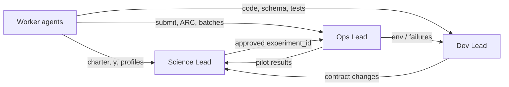

# Lead check-ins — keeping agents aligned

Autonomous CANFAR agents **must not** loop indefinitely without human-or-lead-agent
review. Regular check-ins with the **Science Lead**, **Dev Lead**, and **Ops Lead**
keep requirements, code, and production runs aligned.

## The three leads

| Lead | Roles covered | Owns |
|------|---------------|------|
| **Science Lead** | Science & Visibility Lead, Inference Specialist | Question, priors, γ interpretation, go/no-go science |
| **Dev Lead** | Stack Architect (uvfit), Pipeline Dev (uvkin), ms2uvfit I/O, Validation & QA | Schema, aggregation, bounds, tests, reproducibility |
| **Ops Lead** | CANFAR Ops | Submit cadence, ARC paths, job health, manifests, budgets |

Workers (any agent executing tasks) **propose**; leads **approve or redirect**.

## Cadence (minimum)

| Event | Who checks in with whom | Within |
|-------|-------------------------|--------|
| **Session start** | Worker → all three leads (async charter) | Before first submit |
| **Pre-CANFAR submit** | Ops → Dev Lead (QA gate); Ops → Science Lead (profile + question) | Each batch |
| **Pilot complete** | Ops → Science + Inference (`--evaluate-dod`) | 24 h of job finish |
| **Long-chain start** | Ops → Science Lead (approved `experiment_id`) | Before `--long` |
| **Each `iterate` cycle** | Worker → leads listed in `SCIENCE_STATUS.json` → `checkins.required` | Before executing `next_action` |
| **Tier 1 failure** | Ops → Dev Lead | Same session |
| **Tier 2 failure** | Worker → Science + Dev | Same session |
| **Tier 3 / γ ambiguity** | Worker → Science Lead (mandatory) | Same session |
| **`falsified` or `science_done`** | Worker → all three leads | Before closing loop |
| **Stall** (3+ iterations, no tier improvement) | Worker → all three leads (escalation) | Immediate |

**Weekly** (if campaign runs >7 days): Science Lead posts a one-paragraph status;
Ops confirms job budget and ARC sync.

## Mandatory gates (do not skip)

Agents **must not** proceed without lead acknowledgment when:

1. Changing YAML profiles, MCMC bounds, or flux seed source
2. Submitting `--long` chains (>15k steps)
3. `next_action` contains `seed_matrix` or changes aggregation mode
4. `SCIENCE_STATUS.json` shows `falsified: true` or `overall: science_done`
5. Dev Lead has not confirmed smoke/tests since last uvkin/uvfit commit on ARC

Acknowledgment = lead agent session shown the check-in record, or explicit user approval.

## Check-in record

Workers append to a shared log (per galaxy campaign):

```text
${RESULTS_BASE}/KILOGAS066/agent_checkins/CHECKIN_LOG.md
```

Or use the CLI:

```bash
python3 scripts/record_agent_checkin.py \
  --campaign KILOGAS066 \
  --worker canfar-ops \
  --leads science,dev,ops \
  --summary "Pilot core complete; 5kms_baseline_obsSb Tier2 fail I3" \
  --science-status results/KILOGAS066/science_matrix/5kms_baseline_obsSb/SCIENCE_STATUS.json \
  --decision "Science: proceed with fixrscale arm; Dev: no code change; Ops: submit long fixrscale pilot"
```

Copy the template from [templates/AGENT_CHECKIN.md](templates/AGENT_CHECKIN.md) for
richer entries.

## What each lead reviews

### Science Lead

- Is the **question** still the same? (cored γ under vis-aligned flux)
- Profile + `experiment_id` match the hypothesis test plan
- `SCIENCE_STATUS.json` tiers — especially S1–S7, falsification block
- Approval for: flux anchor change, frozen vs free geometry, production claim

**Prompt:** [prompts/science-visibility-lead.md](prompts/science-visibility-lead.md)

### Dev Lead

- `GIT REVISIONS` in `run.log` match expected ARC checkout
- Aggregation-aware path active; no silent schema drift
- Tests/smoke pass after any code or YAML contract change
- `evaluate_science_status` / scoreboard tooling current on ARC

**Prompts:** [stack-architect-uvfit.md](prompts/stack-architect-uvfit.md),
[pipeline-uvkin-dev.md](prompts/pipeline-uvkin-dev.md), [validation-qa.md](prompts/validation-qa.md)

### Ops Lead

- Job count vs budget; pilot-before-long discipline
- Manifest / `results_dest` paths unique; no overwrite
- Failures classified; no resubmit storm without Dev/Science note
- `aggregate_science_matrix.py --evaluate-dod` run after each batch

**Prompt:** [prompts/canfar-ops.md](prompts/canfar-ops.md)

## Worker agent rules (all roles)

1. Read `SCIENCE_STATUS.json` → `checkins.required` before `next_action`.
2. Record a check-in when any required lead is listed.
3. Do not interpret γ science outcomes without Science Lead note in `CHECKIN_LOG.md`.
4. Do not change uvkin/uvfit on ARC without Dev Lead noting test status.
5. Do not submit new batches without Ops Lead confirming environment paths.

## Alignment diagram



## Integration with DoD loop

After `evaluate_science_status.py`, inspect:

```json
"checkins": {
  "required": ["science_lead", "dev_lead"],
  "reason": "Tier 3 failed: S1, S3 — γ interpretation and prior walls",
  "blocked_until_recorded": true
}
```

While `blocked_until_recorded` is true, workers log a check-in before executing
`next_action`. Ops may run read-only aggregation; no new submits until recorded.

## CANFAR live session

When attached to a running session, leads review:

```bash
tail -30 ${RESULTS_BASE}/KILOGAS066/agent_checkins/CHECKIN_LOG.md
cat .../SCIENCE_STATUS.json | python3 -m json.tool
```

Science Lead joins for Tier 3 decisions; Dev Lead for Tier 1; Ops owns Tier 0 (infra).
